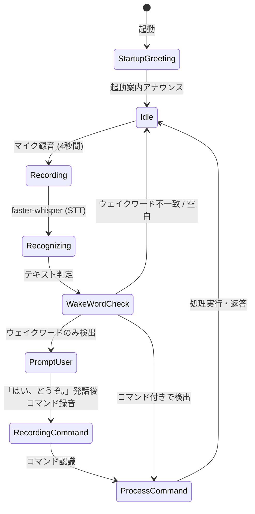

# moOde AI Master (`voice_bot.py`) システム仕様書

本書は、Raspberry Pi 5 上で動作する **moOde audio (MPD)** を、Jetson Orin Nano Super 等のエッジAIデバイスから音声対話およびWeb UI（PC/スマートフォン）経由で統合制御するシステム **`voice_bot.py`** の設計・機能・インターフェース仕様をまとめた技術仕様書です。

---

## 1. システム概要

### 1.1 目的
`voice_bot.py` は、ローカルエッジ環境においてプライバシーを保護しつつ、低遅延で自然な音楽体験を提供するAIアシスタントです。  
ユーザーのマイク入力（音声）およびWebブラウザ（テキストチャット）双方からの要望を受け付け、ローカルLLMによって意図を解釈し、moOde audio の選曲・再生制御を行うとともに、楽曲データベース（`music_meta.db`）に蓄積されたリッチな解説文を音声合成（VOICEVOX）および画面表示で案内します。

### 1.2 主な特徴
- **ハイブリッドUI（音声 ＋ Web Chat）**:
  - マイクからのウェイクワード音声入力（「ヘイ、マスター」）に対応。
  - PCやスマートフォンのWebブラウザからアクセス可能なグラスモフィズムUIを提供。
- **完全ローカル / 高速エッジ処理**:
  - 音声認識: **faster-whisper**（Smallモデル / CPU int8）
  - 意図抽出・対話: **Ollama (Qwen 2.5 1.5B)**
  - 音声合成: **VOICEVOX**（キャラクター: 青山龍星）
- **メタデータ連携 (RAG / 解説文読み上げ)**:
  - SQLiteデータベース（`music_meta.db`）から楽曲の背景・歴史・エピソード（`description`）を検索し、選曲時に自動で解説を読み上げ。
- **リアルタイム双方向同期**:
  - WebSocketにより、音声入力結果、AIの返答、moOdeの再生状態（曲名・アーティスト・ハイレゾ情報・シーク位置等）を全クライアントへ即座にプッシュ配信。
- **エコーキャンセル・発話衝突回避**:
  - システム発話中（TTS再生中）はマイク認識を一時停止し、自らの発話を誤認識するフィードバックループを防止。

---

## 2. システムアーキテクチャ

### 2.1 全体構成図

```mermaid
flowchart TB
    subgraph Client Layer ["ユーザー操作層"]
        MIC["🎙️ マイク入力 (Sennheiser SP 20)"]
        WEB["📱 Webブラウザ (PC / スマホ UI)"]
    end

    subgraph Edge Layer ["Jetson Orin Nano Super (voice_bot.py)"]
        subgraph Input Module
            STT["faster-whisper (STT)<br/>Small / CPU int8"]
            WAKE["ウェイクワード判定<br/>「ヘイ、マスター」"]
            API_ROUTER["FastAPI Router<br/>REST & WebSocket"]
        end

        subgraph Core Engine ["Core Processing Engine (process_user_message)"]
            LLM_PARSER["Ollama (LLM)<br/>意図解析 / JSON Mode<br/>(qwen2.5:1.5b)"]
            FALLBACK["ルールベース判定<br/>(フォールバック)"]
            DISPATCHER["moOde コントローラ<br/>(control_moode)"]
        end

        subgraph Data & Voice Module
            DB[("SQLite<br/>music_meta.db")]
            TTS["VOICEVOX (TTS)<br/>Port: 50021 (青山龍星)"]
            ALSA["aplay (ALSA)<br/>plughw:0,0 (SP 20)"]
        end
    end

    subgraph Audio Player Layer ["Raspberry Pi 5 (moOde audio)"]
        MPD["moOde MPD サーバー<br/>Port: 6600"]
        AUDIO_OUT["🔊 オーディオ出力 / DAC / アンプ"]
    end

    %% Flow connections
    MIC -->|PCM 16kHz| STT
    STT --> WAKE
    WAKE -->|発話テキスト| Core Engine
    WEB -->|HTTP POST /api/chat| API_ROUTER
    API_ROUTER -->|テキスト| Core Engine

    LLM_PARSER -.->|失敗時| FALLBACK
    Core Engine --> LLM_PARSER
    Core Engine --> DISPATCHER

    DISPATCHER -->|MPD Protocol| MPD
    MPD --> AUDIO_OUT
    DISPATCHER <-->|メタデータ & 解説文検索| DB

    Core Engine -->|解説文付き返答| TTS
    TTS -->|WAV + 無音パディング| ALSA

    API_ROUTER <==>|WebSocket 状態同期| WEB
```

---

## 3. 動作要件・依存環境

### 3.1 ハードウェア要件
| 項目 | 推奨構成 | 役割 |
| :--- | :--- | :--- |
| **エッジAIボード** | NVIDIA Jetson Orin Nano Super / 8GB以上 | STT, LLM, TTS, Webサーバー, DBの統合実行 |
| **オーディオデバイス** | Sennheiser SP 20 (USBスピーカーフォン) | マイク入力（16kHz Mono）および音声合成発話出力（ALSA `plughw:0,0`） |
| **音楽プレイヤー** | Raspberry Pi 5 / moOde audio 9.x | 楽曲再生エンジン（MPDサーバー、Port 6600） |
| **ネットワーク** | 同一ローカルネットワーク (LAN / Wi-Fi) | Jetson - Raspberry Pi 間のMPD通信およびWebアクセス |

### 3.2 ソフトウェア・ミドルウェア要件
- **OS**: Ubuntu 22.04 LTS (JetPack 6.x) または Linux / Windows（開発用）
- **Python**: 3.10 以上
- **外部サービス・サーバー**:
  - **Ollama**: `http://localhost:11434` (モデル: `qwen2.5:1.5b` または指定モデル)
  - **VOICEVOX Engine**: `http://localhost:50021` (話者ID: `13` 青山龍星)
  - **moOde audio (MPD)**: `192.168.68.198:6600` (設定変更可能)

### 3.3 Python 主要依存ライブラリ
```text
fastapi>=0.100.0
uvicorn>=0.22.0
websockets>=12.0
python-mpd2>=3.1.0
faster-whisper>=0.10.0
pyaudio>=0.2.13
pydantic>=2.0.0
```

---

## 4. 内部モジュール仕様

### 4.1 設定・グローバル状態管理

#### 定数定義（デフォルト値）
| 変数名 | デフォルト値 | 説明 |
| :--- | :--- | :--- |
| `MOODE_IP` | `"192.168.68.198"` | moOde audio (MPD) の IP アドレス |
| `MOODE_PORT` | `6600` | MPD サーバーのポート番号 |
| `VOICEVOX_URL` | `"http://localhost:50021"` | VOICEVOX サーバーのエンドポイント |
| `OLLAMA_CHAT_URL` | `"http://localhost:11434/api/chat"` | Ollama チャット API エンドポイント |
| `SPEAKER_ID` | `13` | VOICEVOX 話者ID（青山龍星） |
| `LLM_MODEL` | `"qwen2.5:1.5b"` | Ollama で使用する LLM モデル名 |
| `AUDIO_OUTPUT_NAME` | `"Sennheiser"` | 自動検出対象の音声出力デバイス名（部分一致） |
| `AUDIO_OUTPUT_DEV` | `None`（自動検出） | 音声出力先 ALSA デバイス名（`plughw:1,0`、`default` 等） |
| `INPUT_DEVICE_NAME` | `"Sennheiser SP 20"` | マイク入力デバイス名（部分一致） |
| `DB_PATH` | `"music_meta.db"` | SQLite データベースファイルパス |
| `RECORD_SECONDS` | `4` | マイク録音の1サイクル時間（秒） |
| `VOICE_PRE_SILENCE_SEC`| `0.3` | aplay 再生時の頭切れ防止用無音パディング（秒） |

#### グローバル状態変数
- `voice_lock`: 音声合成の排他制御用 `threading.Lock`
- `is_speaking_event`: 発話中フラグ（`threading.Event`）。発話中にマイク録音を停止させる
- `chat_history`: 実行中のチャット履歴リスト（メモリ上保持）
- `active_websockets`: 接続中の全 WebSocket クライアントリスト
- `voice_state`: 音声リスナーの状態辞書 (`is_listening`, `state`, `last_text`, `error`)

---

### 4.2 SQLite データベース選曲モジュール (`search_tracks_from_db`, `find_track_metadata`)

ユーザーからの要望（ジャンル、ムード、エネルギー、ハイレゾ、アーティスト名、曲名、フリーワード等）に基づき、**`music_meta.db` を直接クエリして完全ランダム選曲**します。

#### 1. 楽曲抽出ルール (`search_tracks_from_db`)
- **ジャンル判定**: 「ジャズ」「ロック」「ポップ」「クラシック」等を SQL `genre LIKE '%ジャンル名%'` で検索。
- **ムード / エネルギー**: 「静かな曲」「リラックス」→ `energy_level <= 2`、「アップテンポ」「元気」→ `energy_level >= 4`。
- **ハイレゾ判定**: 「ハイレゾ」「高音質」→ `is_hires = 1`。
- **キーワード検索**: アーティスト名、曲名、アルバム名、解説文に対するあいまい検索。
- **ランダム性＆リピート防止**: 直近に再生した楽曲ID（`recent_played_track_ids` 最大50件）を除外し、SQL `ORDER BY RANDOM()` ＋ Python `random.shuffle()` により、同じジャンルでも毎回完全に異なる楽曲を選定。

#### 2. メタデータ照合 (`find_track_metadata`)
moOde の再生中楽曲から `music_meta.db` のレコードを逆引きし、解説文やハイレゾ判定情報を取得。

---

### 4.3 MPD / moOde 制御モジュール (`control_moode`, `add_db_tracks_to_mpd`, `get_moode_status`)

#### 状態取得 (`get_moode_status`)
- MPD の `status()` および `currentsong()` を取得。
- サンプリングレート / ビット深度の解析、ハイレゾ判定（48kHz超 または 16bit超）。
- DB から解説文（`description`）を取得して統合した辞書を返却。

#### アクション一覧 (`control_moode`)
| アクション (`action`) | パラメータ | 動作内容 |
| :--- | :--- | :--- |
| `play_search` | `query` (文字列) | 1. **`music_meta.db` から合致する楽曲リストを完全ランダム抽出**<br/>2. 抽出された楽曲のファイル名・タイトルで MPD 内を検索し、キューに追加<br/>3. 1曲目のDB解説文（`description`）を取得<br/>4. **音声案内（曲名・アーティスト・解説文）の発話完了後に音楽再生を開始** |
| `play` | - | 再生を再開 (`client.play()`) |
| `pause` | - | 一時停止 (`client.pause(1)`) |
| `stop` | - | 停止 (`client.stop()`) |
| `next` | - | 次のトラックへスキップし、**次の曲の解説文（`description`）を発話してから再生** |
| `previous` | - | 前のトラックへスキップし、**前の曲の解説文（`description`）を発話してから再生** |
| `volume` | `value` (0〜100) | 音量を設定 (`client.setvol(vol)`) |
| `unknown` | - | 音楽操作なし（会話応答のみ） |

---

### 4.4 自動トラック変更監視モジュール (`run_track_watcher_loop`)

moOde の再生進行をバックグラウンドスレッドで常時監視し、**2曲目以降のトラック切り替わり時にも自動で曲紹介をアナウンス**します。

1. **切り替わり検知**: MPD の `currentsong()` を定期取得し、ファイルパスの変更を検出。
2. **一時停止 & 解説取得**: 音楽再生を一旦ポーズし、該当曲の `description` を DB から取得。
3. **FMラジオ風アナウンス**: 「続いては、『〇〇』、アーティスト名です。（解説文）」を VOICEVOX で発話。
4. **音楽再開**: 発話完了後に自動的に音楽再生を再開。

---

### 4.4 LLM 意図解析モジュール (`parse_intent_with_llm`)

Ollama の JSON Mode を利用し、ユーザーの自然言語発話から構造化されたコマンドを抽出します。

#### システムプロンプト設計
```json
{"action":"play_search"|"pause"|"stop"|"next"|"previous"|"unknown","query":"検索語","reply":"日本語返答"}
```

#### Ollama リクエストパラメータ
```json
{
  "model": "qwen2.5:1.5b",
  "messages": [...],
  "stream": false,
  "format": "json",
  "think": false,
  "keep_alive": "10m",
  "options": {
    "num_ctx": 2048,
    "temperature": 0,
    "num_predict": 192
  }
}
```

#### ルールベース・フォールバック
LLM サーバーが停止している場合や JSON 解析に失敗した場合は、正規表現・キーワード検索によるルールベース判定（「止め/停止」→ pause、「次/スキップ」→ next、「かけて/流して」→ play_search）へ安全にフォールバックします。

---

### 4.5 音声合成・出力モジュール (`speak_english`, `speak`, `build_english_track_announcement`)

曲紹介アナウンスは **英語DJモード (`--lang en` / `--en`, デフォルト)** および **日本語モード (`--lang ja` / `--ja`)** に対応しています。

#### 1. 英語DJモード (`build_english_track_announcement`, `clean_english_text_for_speech`, `speak_english`)
- **英語DJナレーション生成 (`build_english_track_announcement`)**:
  - データベース（`music_meta.db`）の **`description_en`（英語解説文）を直接結合**して流暢な英語曲紹介文を生成します。
  - タイトル、アーティスト、および `description_en` を組み合わせたFMラジオDJスタイル（例: `Now playing: 'White Room' by Cream. 'White Room' is a psychedelic rock classic...` / 次曲: `Next up is '...' by ...` / スキップ: `Skipping to '...' by ...`）。
  - `description_en` が未設定の場合は、ローカルLLM（Ollama `qwen2.5:1.5b`）による英語要約またはジャンル・ムードに基づく英語テンプレートで自動補完。
- **英語音声合成 (`speak_english`)**:
  - **edge-tts (最優先)**: `en-US-ChristopherNeural` などの超高音質ニューラル音声（FMラジオDJトーン）で再生。
  - **espeak-ng / espeak (オフライン)**: Linux軽量TTSエンジン。
  - **VOICEVOX (フォールバック)**。

#### 2. 日本語モード (`speak`, `convert_english_to_katakana`)
- **英語発音カタカナ化 (`convert_english_to_katakana`)**: 有名アーティスト・曲名をカタカナに自動変換し、VOICEVOX で読み上げ。
- **無音パディング付加**: 生成された WAV の先頭に `0.3秒` 分の無音 PCM データを付加（オーディオインターフェースの立ち上がり遅延による「頭切れ」防止）。
- **ALSA aplay 再生**: `aplay -D plughw:0,0 -q temp.wav` を実行（エラー時は `default` でリトライ）。
- 一時ファイルの削除および `is_speaking_event.clear()` によるマイク集音再開。

---

### 4.6 音声認識・ウェイクワードリスナー (`run_voice_loop`)

バックグラウンドスレッドで常時マイク入力を監視します。起動時には開始アナウンス（「こんにちは！moOde AI アシスタントです。マイクに向かって『ヘイ、マスター』と話しかけるか、下のチャット欄から曲やジャンルをリクエストしてください。」）が自動発話されます。

#### 動作サイクル


- **ウェイクワード正規表現**:
  - `ヘイ[\s、,。！？!?]*マスター`
  - `へい[\s、,。！？!?]*ますたー`
  - `hey[\s、,。！？!?]*master`
- **ハルシネーション除外フィルタ**:
  - 「ご視聴ありがとうございました」「チャンネル登録」「高評価」「字幕」等の Whisper 特有の無音時ハルシネーションを自動検知して破棄。

---

## 5. Web API (REST API) 仕様

すべての API は Base URL `http://<Jetson-IP>:8000` で提供されます。

### 5.1 `GET /`
- **概要**: Web UI フロントエンド（`web/index.html`）を返却。
- **レスポンス**: HTML または JSON メッセージ。

---

### 5.2 `POST /api/chat`
- **概要**: Web チャット画面からのテキストメッセージを受信・処理。
- **Request Body (JSON)**:
  ```json
  {
    "message": "落ち着いたジャズをかけて",
    "speak": true
  }
  ```
  | フィールド | 型 | 必須 | 説明 |
  | :--- | :--- | :---: | :--- |
  | `message` | `string` | YES | ユーザーからの入力テキスト |
  | `speak` | `boolean` | NO | 音声読み上げを行うか（デフォルト: `true`） |

- **Response Body (JSON)**:
  ```json
  {
    "action": "play_search",
    "query": "Jazz",
    "reply": "『Take Five』（Dave Brubeck）を再生します。1959年にリリースされたモダン・ジャズ屈指の名盤『Time Out』収録の代表曲です。",
    "description": "1959年にリリースされたモダン・ジャズ屈指の名盤『Time Out』収録の代表曲です。",
    "track_info": {
      "title": "Take Five",
      "artist": "Dave Brubeck",
      "file": "Jazz/Dave_Brubeck/Take_Five.flac"
    },
    "tracks_added": ["Take Five", "Blue Rondo a la Turk"],
    "control_success": true
  }
  ```

---

### 5.3 `GET /api/status`
- **概要**: 現在の moOde 再生ステータス、現在曲詳細、音声リスナー状態を取得。
- **Response Body (JSON)**:
  ```json
  {
    "player_status": {
      "connected": true,
      "state": "play",
      "volume": "65",
      "elapsed": 42.5,
      "duration": 324.0,
      "song": {
        "title": "Take Five",
        "artist": "Dave Brubeck",
        "album": "Time Out",
        "file": "Jazz/Dave_Brubeck/Take_Five.flac",
        "id": "1",
        "sample_rate": "96000",
        "bit_depth": "24",
        "is_hires": true,
        "description": "1959年にリリースされたモダン・ジャズ屈指の名盤..."
      }
    },
    "voice_status": {
      "is_listening": true,
      "state": "idle",
      "last_text": "ジャズをかけて",
      "error": null
    },
    "moode_ip": "192.168.68.198:6600"
  }
  ```

---

### 5.4 `POST /api/player/control`
- **概要**: Web UI のボタン等から再生・一時停止・音量変更を直接操作。
- **Request Body (JSON)**:
  ```json
  {
    "action": "volume",
    "value": 70
  }
  ```
  | アクション名 | `value` の内容 | 説明 |
  | :--- | :--- | :--- |
  | `play` | 不要 (`null`) | 再生 |
  | `pause` | 不要 (`null`) | 一時停止 |
  | `stop` | 不要 (`null`) | 停止 |
  | `next` | 不要 (`null`) | 次の曲 |
  | `previous` | 不要 (`null`) | 前の曲 |
  | `volume` | 整数値 (`0〜100`) | 音量変更 |

- **Response Body (JSON)**:
  ```json
  {
    "result": { "success": true, "message": "音量を 70% に設定しました。" },
    "status": { ... }
  }
  ```

---

### 5.5 `GET /api/player/cover`
- **概要**: 再生中楽曲または指定楽曲のアルバムジャケット画像（Cover Art / Sleeve）を取得（MPD albumart/readpicture ➔ moOde Web ➔ iTunes API ➔ デフォルトSVGの自動多段取得・キャッシュ）。
- **Query Parameters**:
  - `file` (string, 任意): 楽曲ファイルパス
  - `artist` (string, 任意): アーティスト名
  - `album` (string, 任意): アルバム名
  - `title` (string, 任意): 曲名
- **Response**: 画像バイナリ (`image/jpeg` または `image/svg+xml`)

---

### 5.6 `GET /api/history`
- **概要**: サーバー起動時からのチャット送受信履歴（メモリ上）を取得。
- **Response Body (JSON)**:
  ```json
  {
    "history": [
      {
        "sender": "user",
        "text": "ジャズをかけて",
        "source": "voice",
        "timestamp": "20:15:30"
      },
      {
        "sender": "assistant",
        "text": "『Take Five』を再生します。...",
        "source": "voice",
        "action": "play_search",
        "query": "Jazz",
        "track_info": { ... },
        "description": "...",
        "tracks_added": ["Take Five"],
        "timestamp": "20:15:32"
      }
    ]
  }
  ```

---

## 6. WebSocket プロトコル仕様

リアルタイムな状態同期のために WebSocket エンドポイント `/ws` を提供します。

- **URL**: `ws://<Jetson-IP>:8000/ws`

### 6.1 サーバーからクライアントへのプッシュイベント

#### ① 状態更新イベント (`status_update`)
接続時および再生状態・音声状態変化時に自動送信されます。
```json
{
  "type": "status_update",
  "player_status": {
    "connected": true,
    "state": "play",
    "volume": "60",
    "elapsed": 12.0,
    "duration": 240.0,
    "song": {
      "title": "Song Title",
      "artist": "Artist Name",
      "album": "Album Name",
      "is_hires": true,
      "sample_rate": "96000",
      "bit_depth": "24",
      "description": "楽曲解説文"
    }
  },
  "voice_status": {
    "is_listening": true,
    "state": "idle",
    "last_text": "..."
  }
}
```

#### ② チャットメッセージ受信イベント (`chat_message`)
音声または他の Web クライアントからメッセージが入力された際にリアルタイム配信されます。
```json
{
  "type": "chat_message",
  "message": {
    "sender": "assistant",
    "text": "『Fly Me to the Moon』を再生します。",
    "source": "voice",
    "action": "play_search",
    "timestamp": "20:18:05"
  }
}
```

#### ③ 音声認識ステータスイベント (`voice_event`)
マイクのリッスン状態や認識中状態を通知します。
```json
{
  "type": "voice_event",
  "event": "listening" 
}
```
※ `event` の値: `"idle"`, `"listening"`, `"recognizing"`

#### ④ リアルタイム処理ステータスイベント (`process_status`)
バックエンドで現在実行中のフェーズ（AI意図解析、DB検索、キュー更新、DJ音声合成、再生開始など）を Web UI の **Process Tracker** にリアルタイム配信します。
```json
{
  "type": "process_status",
  "step": "llm",
  "detail": "🤖 AIが選曲・意図を解釈中 (qwen2.5:1.5b): 「Jazzをかけて」",
  "timestamp": 1724400000.123
}
```
※ `step` の値:
- `"idle"`: 音声待機中
- `"listening"` / `"stt"`: 音声録音・文字起こし中 (Whisper)
- `"llm"`: AI選曲・意図解釈中 (Qwen)
- `"db"`: 楽曲データベース検索中 (SQLite `music_meta.db`)
- `"moode"`: moOde 再生キュー更新・プレイヤー操作中 (MPD)
- `"tts"`: DJ曲紹介音声の合成・出力中 (edge-tts / VOICEVOX)
- `"playing"`: 音楽再生スタート

---

## 7. コマンドライン引数 & 起動方法

### 7.1 引数一覧
| 引数 | エイリアス | 型 | デフォルト値 | 説明 |
| :--- | :--- | :--- | :--- | :--- |
| `--lang` | `-l` | `string` | `en` | 曲紹介の言語指定 (`en`, `english`, `ja`, `japanese`) |
| `--en` | `--english` | フラグ | - | **英語DJモード**で起動（`description_en` を英語音声で再生） |
| `--ja` | `--japanese` | フラグ | - | **日本語モード**で起動（`description_ja` を VOICEVOX で再生） |
| `--model` | `--llm-model` | `string` | `qwen2.5:1.5b` | Ollama LLM モデル名 |
| `--moode-ip` | - | `string` | `192.168.68.198` | moOde audio (Raspberry Pi) の IP アドレス |
| `--moode-port`| - | `int` | `6600` | moOde audio の MPD ポート番号 |
| `--audio-dev` | - | `string` | `None`（自動検出） | 音声出力先 ALSA デバイス（例: `plughw:1,0`, `default`） |
| `--host` | - | `string` | `0.0.0.0` | FastAPI Web サーバーのバインドホスト |
| `--port` | - | `int` | `8000` | FastAPI Web サーバーのポート番号 |
| `--no-voice` | - | フラグ | `False` | マイク音声リスナースレッドを起動しない（Web専用モード） |

### 7.2 起動コマンド例

```bash
# 1. 英語DJモードで起動（デフォルト: description_en を英語FMラジオDJ風に読み上げ）
python voice_bot.py --en
# または
python voice_bot.py --lang en

# 2. 日本語モードで起動（description_ja を VOICEVOX 青山龍星で読み上げ）
python voice_bot.py --ja
# または
python voice_bot.py --lang ja

# 3. moOdeのIPとWebポートを変更して英語DJモード起動
python voice_bot.py --en --moode-ip 192.168.1.50 --port 8080

# 4. マイク不要・Web UI のみで起動（開発環境やマイク非接続時）
python voice_bot.py --en --no-voice
```

---

## 8. エラーハンドリング & セーフティ設計

1. **オーディオデバイス・ライブラリの非同期安全インポート**:
   - `pyaudio`, `faster_whisper`, `mpd` がインストールされていない環境や、マイクデバイスが存在しない環境でも Web サーバー単体として正常起動するように `try...except ImportError` でガード。
2. **LLM 接続断へのフォールバック**:
   - Ollama サーバーがダウンしている場合や応答タイムアウト時、正規表現ベースのルール判定で即座に応答し、システム全体が停止することを防止。
3. **MPD 接続切断の自動回復**:
   - リクエストごとに MPDClient を短時間接続 (`timeout=5`) して切断するステートレス設計を採用。moOde が再起動しても次回アクセス時に自動で再接続。
4. **マイク誤認識（エコー）防止機構**:
   - `is_speaking_event` によるハードウェア発話と録音の排他制御。
   - Whisper の無音ハルシネーション（「ご視聴〜」等）の自動破棄。

---

## 9. 関連ファイル構成

```text
Audio_SQL/
├── voice_bot.py            # メインシステム実行ファイル（FastAPI + STT + TTS + MPD）
├── build_music_db.py       # 楽曲メタデータ抽出・DB構築バッチ
├── cleanup_long_tracks.py  # 20分以上の長尺音源クリーンアップ
├── music_meta.db           # 楽曲メタデータ SQLite データベース
├── DB_SPEC.md              # データベース仕様書
├── VOICE_BOT_SPEC.md       # 本仕様書
├── README.md               # プロジェクト概要ドキュメント
└── web/
    └── index.html          # グラスモフィズム Web UI（HTML/CSS/JS）
```
