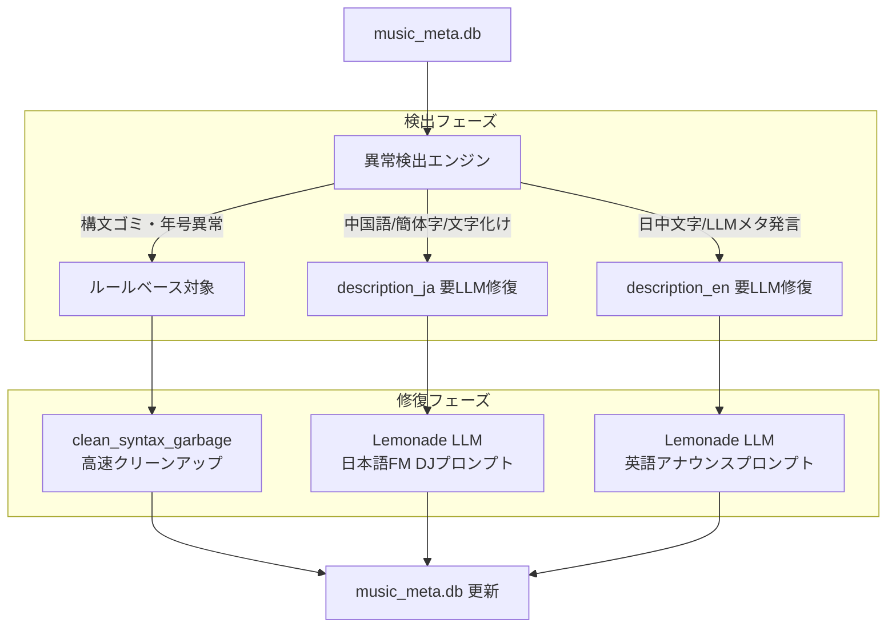

# 楽曲解説文（description_ja / description_en）修復ツール仕様書 (fix_descriptions.py)

## 1. 概要
`fix_descriptions.py` は、SQLite データベース (`music_meta.db`) に登録されている楽曲解説文 (`description_ja`, `description_en`) の品質異常を高精度に検出し、自動クリーンアップおよびローカル LLM による高品質な再生成・修復を行う専用ツールです。

---

## 2. 背景と解決する課題

`music_meta.db` の構築・生成過程において、以下の問題が発生していました：

1. **`description_ja` (日本語解説文)**:
   - **純中国語文**: ひらがなが全く含まれず、簡体字・中国語構文のみで構成されている（例: 老鹰乐队、在《地狱结冰》现场专辑中、展现了...）。
   - **日中混在文**: 日本語の助詞（「は」など）を含みつつも、中身が中国語構文・語彙（「老鹰乐队」「这首歌以其独特的旋律和充满力量感的吉他演奏而闻名」など）になっている。
   - **簡体字・中国語語彙混入**: 「展现」「充满」「融合」「编曲」「作词」「收录于」などの中国語表現の残存。
   - **構文ゴミ・文字化け**: 冒頭の `: " "`、末尾の `",`、プレフィックス `1 1n 1 sentence, `、不正シーケンスや文字化け。
   - **年号の異常**: `1 時代`, `173年`, `1 1970年代` など。

2. **`description_en` (英語解説文)**:
   - **LLMメタ発言・プロンプト漏れ**: `Here's a rewritten version...`, `(Note: ...)`, `[Your Name] English Music Announcer...`, `Alternatively...` 等の会話テキストが残存。
   - **日本語・中国語文字の混入**: 英語フィールド内に漢字・ひらがな・カタカナが含まれている。
   - **構文ゴミ・クォート破損**: `\"Passing The Time\"`, `White Room"`, `: " "`, 先頭の余計な記号。

---

## 3. 処理アーキテクチャ



---

## 4. 異常検出ロジック

### 4.1 description_ja
- **純中国語文 (`pure_chinese`)**: ひらがな（`\u3040-\u309F`）が0文字 かつ 漢字（CJK）を含む。
- **日中混在構文 (`mixed_chinese_syntax`)**: `这首`, `由…创作`, `展现了`, `融合了`, `充满了`, `收录于`, `发行于`, `老鹰乐队`, `以其独特的`, `带给听众`, `让消费者`, `是一首` などの中国語特有フレーズを検出。
- **簡体字混入 (`simplified_chinese_chars`)**: 日本語常用/人名漢字に含まれない明確な簡体字（`录`, `乐`, `发`, `编`, `摇`, `滚`, `队`, `艺术`, `标志`, `质`, `轻`, `运`, `连`, `选`, `钟`, `键` 等）が2文字以上検出された場合。
- **LLMメタ発言 (`llm_meta_junk`)**: `Here's`, `Note:`, `以下是`, ```` などの定型メタ句。
- **文字化け (`mojibake`)**: `\ufffd` などの不正コード。

### 4.2 description_en
- **日中文字混入 (`contains_cjk_or_japanese`)**: 漢字、ひらがな、カタカナが1文字でも含まれる場合。
- **LLMメタ発言 (`llm_meta_junk`)**: `Here is`, `Here's`, `Note:`, `Alternatively`, `[Your Name]`, `Let me know`, ```` 等の英語LLMメタ発言。
- **未設定・空レコード (`empty`)**: 解説文が存在しない場合。

---

## 5. 修復機能

### 5.1 ルールベース構文クリーンアップ
- 冒頭・末尾の `: " "`, `",`, `"}`, `{`, `\"` などを除去。
- 先頭の `1 1n 1 sentence, `, `1, "`, `1. ` などのプロンプト残骸を除去。
- 年号の正規化（`1 1970年代` $\to$ `1970年代`、`173年` $\to$ `1973年`、`1700s` $\to$ `1970s`）。

### 5.2 LLM による解説文再生成
- **Lemonade Server** (`http://localhost:13305/v1`) の OpenAI 互換 API を呼び出し。
- **Stop Sequences**: `["\nUser:", "\nAssistant:", "\n\n", "User:", "【", "Note:"]` を指定し、会話ループを完全に防止。
- **Few-shot 例示**: 日本語・英語ともに高品質なワンショット例を与え、前置きのない純粋な1〜2文を出力。
- **抽出後処理 (`extract_clean_text`)**: 先頭の前置き（「ここでは、〜」「Here is...」等）や末尾の注記を完全にストリップ。

---

## 6. コマンドラインオプション

```powershell
python .\fix_descriptions.py [オプション]
```

| オプション | 引数 | 説明 |
| :--- | :--- | :--- |
| `--all` | なし | 構文クリーンアップ、日本語解説修復、英語解説修復をすべて実行 |
| `--clean-syntax-only` | なし | LLMを呼ばず、構文ゴミ・年号のルールベースクリーンアップのみ高速実行 |
| `--ja` | なし | 日本語解説文 (`description_ja`) の中国語・異常のみを修復 |
| `--en` | なし | 英語解説文 (`description_en`) の日中文字・メタ発言のみを修復 |
| `--dry-run` | なし | DB を変更せず、対象件数と修正プレビューのみを表示 |
| `--limit` | 整数 (N) | 修復処理の最大件数を制限（テスト・検証用） |
| `-y`, `--yes` | なし | 確認プロンプトをスキップして即時実行 |
| `--db` | パス | 対象 SQLite DB パス（デフォルト: `music_meta.db`） |
| `--base-url` | URL | Lemonade Server の URL（デフォルト: `http://localhost:13305/v1`） |

---

## 7. 実行例

```powershell
# 1. まずルールベースで全体の構文ゴミをクリーンアップ
python .\fix_descriptions.py --clean-syntax-only -y

# 2. 日本語解説文のプレビュー確認（先頭5件）
python .\fix_descriptions.py --ja --limit 5 --dry-run

# 3. 日本語解説文の全件修復
python .\fix_descriptions.py --ja -y

# 4. 英語解説文の全件修復
python .\fix_descriptions.py --en -y

# 5. 全体一括修復
python .\fix_descriptions.py --all -y
```
