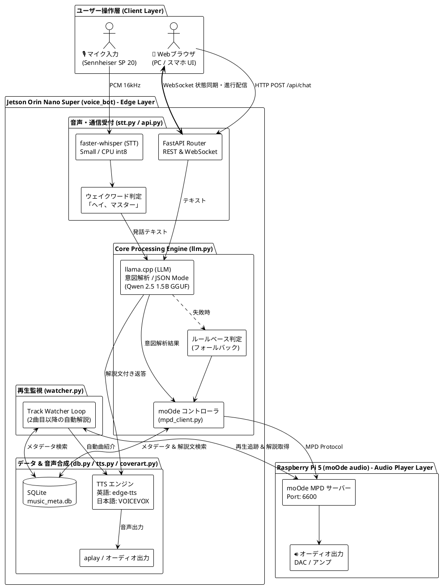
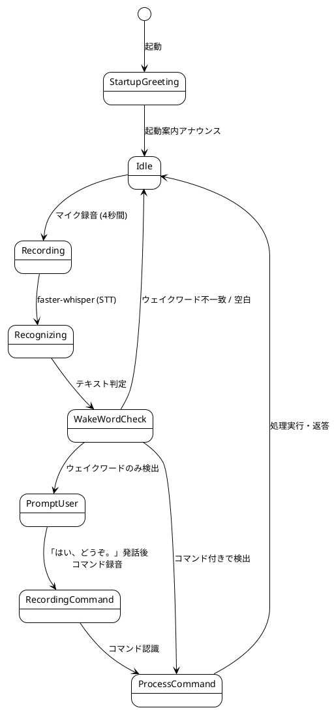

# moOde AI Master (`voice_bot`) システム仕様書

本書は、Raspberry Pi 5 上で動作する **moOde audio (MPD)** を、Jetson Orin Nano Super 等のエッジAIデバイスから音声対話およびWeb UI（PC/スマートフォン）経由で統合制御するシステム **`voice_bot`** の設計・機能・インターフェース仕様をまとめた技術仕様書です。

---

## 1. システム概要

### 1.1 目的
`voice_bot` は、ローカルエッジ環境においてプライバシーを保護しつつ、低遅延で自然な音楽体験を提供するAIアシスタントです。  
ユーザーのマイク入力（音声）およびWebブラウザ（テキストチャット）双方からの要望を受け付け、ローカルLLMによって意図を解釈し、moOde audio の選曲・再生制御を行うとともに、楽曲データベース（`music_meta.db`）に蓄積されたリッチな解説文を音声合成（英語 FM DJ / 日本語 VOICEVOX）および画面表示で案内します。

### 1.2 主な特徴
- **ハイブリッドUI（音声 ＋ Web Chat ＋ 設定画面）**:
  - マイクからのウェイクワード音声入力（「ヘイ、マスター」/「Hey Master」）に対応。
  - PCやスマートフォンのWebブラウザからアクセス可能なグラスモフィズムUIを提供。
  - **Settings（設定）モーダル**: デモモードのON/OFF、言語モード切替、デイリー情報ON/OFF、moOde接続先変更をWeb上から即時設定・永続化保存。
- **デモモード (Demo Mode / Mock MPD)**:
  - moOde (Raspberry Pi 5) 実機が接続されていない環境でも、`music_meta.db` を活用した選曲・再生・曲送り・アルバムジャケット表示・解説文読み上げの操作性を完全シミュレーション体験可能。
- **完全ローカル / 高速エッジ処理**:
  - 音声認識: **faster-whisper**（Smallモデル / CPU int8）
  - 意図抽出・対話: **llama.cpp (Google Gemma 4 E2B IT GGUF)**
  - 音声合成:
    - 英語DJモード: **edge-tts**（`en-US-ChristopherNeural`）/ Google TTS / espeak-ng
    - 日本語モード: **VOICEVOX**（キャラクター: 青山龍星）
- **メタデータ連携 (RAG / 解説文読み上げ)**:
  - SQLiteデータベース（`music_meta.db`）から楽曲の背景・歴史・エピソード（`description_ja` / `description_en`）を検索し、選曲時およびトラック切り替わり時に自動で解説を読み上げ。
- **リアルタイム双方向同期**:
  - WebSocketにより、音声認識イベント、AI返答、moOde再生状態（曲名・アーティスト・ハイレゾ情報・シーク位置等）、処理進行状況（Process Tracker）を全クライアントへ即座にプッシュ配信。
- **エコーキャンセル・発話衝突回避**:
  - システム発話中（TTS再生中）はマイク認識を一時停止し、自らの発話を誤認識するフィードバックループを防止。
- **モジュール化・高保守性アーキテクチャ**:
  - 単一の肥大スクリプトから、設定・状態・LLM・STT・TTS・監視・Web API に役割分離されたパッケージ構成を採用。

---

## 2. システムアーキテクチャ

### 2.1 全体構成図



---

## 3. モジュール構成 & 責務

システムは `voice_bot/` パッケージ配下に責務ごとに分割されています。

```text
Audio_SQL/
├── voice_bot.py            # 互換起動用エントリーポイント (thin wrapper)
├── voice_bot_config.json   # 動作設定ファイル (moOde, LLM, 音声, 天気, サーバー等)
├── voice_bot/              # 音声ボット本体パッケージ
│   ├── __init__.py         # パッケージ初期化・エントリーエクスポート
│   ├── __main__.py         # `python -m voice_bot` 実行用エントリーポイント
│   ├── config.py           # 設定値・定数定義 & voice_bot_config.json ロード
│   ├── state.py            # 共有状態管理（WebSocketクライアントリスト、チャット履歴等）
│   ├── broadcaster.py      # WebSocket リアルタイム配信 & 進行ステータス通知
│   ├── daily_info.py       # 天気・日付・今日のエピソード取得 & 起動ナレーション生成
│   ├── llm.py              # LLM 意図解析 (llama.cpp) & ユーザーリクエスト処理コア
│   ├── watcher.py          # トラック変更監視ループ (2曲目以降の自動解説) & 起動案内
│   ├── stt.py              # 音声認識 (Whisperモデル、マイク録音、STT処理、音声ループ)
│   ├── api.py              # FastAPI Web アプリケーション & REST/WebSocket エンドポイント
│   ├── main.py             # CLI 引数解析、設定ファイル同期、スレッド起動オーケストレーション
│   ├── coverart.py         # アルバムジャケット画像取得（MPD/Web/iTunes API）
│   ├── db.py               # 楽曲メタデータ DB アクセス層（検索・照合・キュー追加）
│   ├── mpd_client.py       # moOde / MPD 制御・操作 & 再生状態取得
│   └── tts.py              # 音声合成・出力（英語 edge-tts / 日本語 VOICEVOX）
├── build_music_db.py       # 楽曲メタデータ抽出・DB構築バッチ
├── cleanup_long_tracks.py  # 長尺音源クリーンアップバッチ
├── music_meta.db           # 楽曲メタデータ SQLite データベース
├── README.md               # プロジェクト概要ドキュメント
├── doc/                    # 仕様書・ドキュメントフォルダ
│   ├── DB_SPEC.md          # データベース仕様書
│   └── VOICE_BOT_SPEC.md   # 本仕様書
└── web/
    └── index.html          # グラスモフィズム Web UI（HTML/CSS/JS）
```

### 3.1 各モジュールの役割詳細

| モジュール | 主な責務・提供機能 |
| :--- | :--- |
| **`voice_bot_config.json`** | システム全体の設定ファイル。デモモード、moOde IP・ポート、LLMモデル、アナウンス言語、オーディオデバイス、滋賀県栗東市等の天気設定、Webサーバー設定を管理。 |
| **`voice_bot/config.py`** | `load_config_from_file()` による `voice_bot_config.json` の自動パース・反映、`save_config_to_file()` による設定保存・永続化、および `get_current_settings()`。 |
| **`voice_bot/daily_info.py`** | Open-Meteo API による天気取得、Wikipedia / Web検索による今日のエピソード取得、および llama.cpp LLM を用いた起動時デイリーナレーションの自動生成・フォールバック合成。 |
| **`voice_bot/state.py`** | `chat_history`, `active_websockets`, `voice_state`, `current_processing_state` の定義および同一曲判定ヘルパー `is_same_track()`。 |
| **`voice_bot/broadcaster.py`** | `broadcast_event()`, `broadcast_process_status()`, `broadcast_status()` による WebSocket 全体へのリアルタイムプッシュ通信。 |
| **`voice_bot/llm.py`** | `http_post_json()`, `parse_intent_with_llm()` による LLM 意図解析、および `process_user_message()` による音声・チャット共通処理エンジン。 |
| **`voice_bot/watcher.py`** | `run_track_watcher_loop()` による moOde 再生曲変更の常時監視と自動曲紹介発話、`play_startup_greeting()` による起動アナウンス（基本案内＋デイリーインフォメーション統合）。 |
| **`voice_bot/stt.py`** | `init_whisper()`, `record_audio_stream()`, `speech_to_text()`, `run_voice_loop()` によるマイク入力監視・ウェイクワード検知。 |
| **`voice_bot/api.py`** | FastAPI インスタンス作成、静的ファイル配信 (`/`)、REST API (`/api/chat`, `/api/status`, `/api/settings`, `/api/player/control`, `/api/player/cover`, `/api/history`)、WebSocket (`/ws`)。 |
| **`voice_bot/main.py`** | `voice_bot_config.json` の先行ロード、CLI 引数解析 (`argparse`) による上書き、監視スレッド・音声ループ起動、Uvicorn サーバー起動。 |
| **`voice_bot/coverart.py`** | アルバムアートの多段探索（ローカル ➔ MPD albumart ➔ readpicture ➔ moOde coverart.php ➔ iTunes API ➔ Deezer API ➔ デフォルトSVG）とキャッシュ。 |
| **`voice_bot/mpd_client.py`** | MPD クライアント接続管理、`control_moode()` による再生・一時停止・選曲・音量制御、`get_moode_status()` による詳細再生情報取得、および `DemoPlayer` / `MockMPDClient` によるデモモードシミュレーション。 |
| **`voice_bot/tts.py`** | `speak()` (VOICEVOX), `speak_english()` (edge-tts / Google TTS), `build_english_track_announcement()` による曲紹介文生成、ALSA デバイス検出。 |
| **`voice_bot.py`** | ルート直下の互換起動用 thin wrapper (`from voice_bot.main import main; main()`)。 |

### 3.2 設定ファイル仕様 (`voice_bot_config.json`)

`voice_bot` は起動時にルート直下の `voice_bot_config.json` を自動読み込みます（`--config <path>` で任意ファイルを指定可能）。
CLI引数が同時に渡された場合は、CLI引数の値が優先されます。

```json
{
  "moode": {
    "ip": "192.168.68.198",
    "port": 6600
  },
  "llm": {
    "model": "qwen2.5-1.5b-instruct",
    "llama_cpp_chat_url": "http://localhost:8080/v1/chat/completions"
  },
  "announcement": {
    "language": "en",
    "english_voice": "en-US-ChristopherNeural",
    "voicevox_url": "http://localhost:50021",
    "speaker_id": 13
  },
  "audio": {
    "output_device_name": "Sennheiser",
    "output_alsa_dev": null,
    "input_device_name": "Sennheiser SP 20",
    "input_device_index": null,
    "enable_mic": false
  },
  "weather_and_daily_info": {
    "enable": true,
    "city": "Ritto, Shiga",
    "city_ja": "滋賀県栗東市",
    "latitude": 35.0163,
    "longitude": 135.9733,
    "timezone": "Asia/Tokyo"
  },
  "server": {
    "host": "0.0.0.0",
    "port": 8000
  }
}
```

---

## 4. 動作要件・依存環境

### 4.1 ハードウェア要件
| 項目 | 推奨構成 | 役割 |
| :--- | :--- | :--- |
| **エッジAIボード** | NVIDIA Jetson Orin Nano Super / 8GB以上 | STT, LLM, TTS, Webサーバー, DBの統合実行 |
| **オーディオデバイス** | Sennheiser SP 20 (USBスピーカーフォン) | マイク入力（16kHz Mono）および音声合成発話出力（ALSA `plughw:0,0`） |
| **音楽プレイヤー** | Raspberry Pi 5 / moOde audio 9.x | 楽曲再生エンジン（MPDサーバー、Port 6600） |
| **ネットワーク** | 同一ローカルネットワーク (LAN / Wi-Fi) | Jetson - Raspberry Pi 間のMPD通信およびWebアクセス |

### 4.2 ソフトウェア・ミドルウェア要件
- **OS**: Ubuntu 22.04 LTS (JetPack 6.x) または Linux / Windows（開発用）
- **Python**: 3.10 以上
- **外部サービス・サーバー**:
  - **llama.cpp**: `http://localhost:8080/v1` (モデル: 使用するGGUFモデル名)
  - **VOICEVOX Engine**: `http://localhost:50021` (話者ID: `13` 青山龍星)
  - **moOde audio (MPD)**: `192.168.68.198:6600` (設定変更可能)

### 4.3 Python 主要依存ライブラリ
```text
fastapi>=0.100.0
uvicorn>=0.22.0
websockets>=12.0
python-mpd2>=3.1.0
faster-whisper>=0.10.0
pyaudio>=0.2.13
pydantic>=2.0.0
edge-tts>=6.1.0
```

---

## 5. 内部機能仕様

### 5.1 SQLite データベース選曲 (`db.py`)
ユーザーからの要望（ジャンル、ムード、エネルギー、ハイレゾ、アーティスト名、曲名、フリーワード等）に基づき、**`music_meta.db` を直接クエリして選曲**します。

#### 1. 楽曲抽出ルール (`search_tracks_from_db`)
- **ジャンル判定**: 「ジャズ」「ロック」「ポップ」「クラシック」等を SQL `genre LIKE '%ジャンル名%'` で検索。
- **ムード / エネルギー**: 「静かな曲」「リラックス」→ `energy_level <= 2`、「アップテンポ」「元気」→ `energy_level >= 4`。
- **ハイレゾ判定**: 「ハイレゾ」「高音質」→ `is_hires = 1`。
- **キーワード検索**: アーティスト名、曲名、アルバム名、解説文に対するあいまい検索。
- **ランダム性＆リピート防止**: 直近に再生した楽曲ID（`recent_played_track_ids` 最大50件）を除外し、SQL `ORDER BY RANDOM()` ＋ Python `random.shuffle()` により、同じジャンルでも毎回異なる楽曲を選定。

#### 2. メタデータ照合 (`find_track_metadata`)
moOde の再生中楽曲から `music_meta.db` のレコードを逆引きし、解説文（`description_ja`, `description_en`）やハイレゾ判定情報を取得。

---

### 5.2 MPD / moOde 制御 (`voice_bot/mpd_client.py`)

#### 状態取得 (`get_moode_status`)
- MPD の `status()` および `currentsong()` を取得。
- サンプリングレート / ビット深度の解析、ハイレゾ判定（48kHz超 または 16bit超）。
- DB から解説文（`description_ja`, `description_en`）を取得して統合した辞書を返却。

#### アクション一覧 (`control_moode`)
| アクション (`action`) | パラメータ | 動作内容 |
| :--- | :--- | :--- |
| `play_search` | `query` (文字列) | 1. **`music_meta.db` から合致する楽曲リストを完全ランダム抽出**<br/>2. 抽出された楽曲のファイル名・タイトルで MPD 内を検索し、キューに追加<br/>3. 1曲目のDB解説文を取得<br/>4. **音声案内（曲名・アーティスト・解説文）の発話完了後に音楽再生を開始** |
| `play` | - | 再生を再開 (`client.play()`) |
| `pause` | - | 一時停止 (`client.pause(1)`) |
| `stop` | - | 停止 (`client.stop()`) |
| `next` | - | 次のトラックへスキップし、**次の曲の解説文を発話してから再生** |
| `previous` | - | 前のトラックへスキップし、**前の曲の解説文を発話してから再生** |
| `volume` | `value` (0〜100) | 音量を設定 (`client.setvol(vol)`) |
| `unknown` | - | 音楽操作なし（会話応答のみ） |

---

### 5.3 自動トラック変更監視 & 再生完了案内 (`voice_bot/watcher.py`)

moOde の再生進行をバックグラウンドスレッドで常時監視し、**2曲目以降のトラック切り替わり時の自動曲紹介** および **全曲再生完了時の案内と次曲リクエスト問いかけ** を行います。

#### 1. 2曲目以降の自動曲紹介フロー
1. **切り替わり検知**: MPD の `currentsong()` を定期取得し、ファイルパスや曲IDの変更を検出。
2. **一時停止 & 解説取得**: 音楽再生を一旦ポーズし、該当曲の解説文を DB から取得。
3. **曲紹介アナウンス**: 英語DJモードまたは日本語モードで曲紹介を発話。
4. **音楽再開**: 発話完了後に自動的に音楽再生を再開。

#### 2. 全曲再生完了案内 & 次曲リクエスト問いかけフロー (`announce_playback_finished`)
1. **再生終了検知**: 再生中状態 (`play`) からキューの最後まで到達して停止状態 (`stop`) に遷移した瞬間を検知。
2. **完了アナウンス & 問いかけ**:
   - **英語DJモード**: `"All playback has finished. What would you like to listen to next? Say 'Hey Master' to request a song, or use the web chat below to make a request."`
   - **日本語モード**: `"すべての曲の再生が終了しました。今度はどんな曲をかけますか？マイクに向かってリクエストするか、下のチャット欄からお知らせください。"`
3. **Webチャット & ステータス配信**: チャット画面へ終了メッセージを追加し、音声待機状態（「ヘイ、マスター」）へ復帰。
4. **多重発話防止**: 次に新しい再生が開始されるまで重複発話を抑制。

---

### 5.4 LLM 意図解析 (`voice_bot/llm.py`)

llama.cpp の OpenAI互換 JSON Mode を利用し、ユーザーの自然言語発話から構造化されたコマンドを抽出します。

#### システムプロンプト設計
```json
{"action":"play_search"|"pause"|"stop"|"next"|"previous"|"unknown","query":"検索語","reply":"日本語返答"}
```

#### ルールベース・フォールバック
LLM サーバーが停止している場合や JSON 解析に失敗した場合は、正規表現・キーワード検索によるルールベース判定（「止め/停止」→ pause、「次/スキップ」→ next、「かけて/流して」→ play_search）へ安全にフォールバックします。

---

### 5.5 音声合成・出力 (`voice_bot/tts.py`)

曲紹介アナウンスは **英語DJモード (`--lang en` / `--en`, デフォルト)** および **日本語モード (`--lang ja` / `--ja`)** に対応しています。

#### 1. 英語DJモード (`build_english_track_announcement`, `speak_english`)
- **英語DJナレーション生成 (`build_english_track_announcement`)**:
  - データベース（`music_meta.db`）の **`title_en`（英語曲名・ローマ字）および `artist_en`（英語アーティスト名・ローマ字）を最優先活用**。
  - `title_en` / `artist_en` が未登録、または日本語文字（漢字・ひらがな・カタカナ）が残存している場合は、**`pykakasi` によるヘボン式ローマ字変換（`to_roman_if_japanese`）を自動適用**（`pykakasi` 未インストール環境でも安全にフォールバック）。
  - データベースの **`description_en`（英語解説文）を直接結合**して流暢な英語曲紹介文を生成。
  - タイトル、アーティスト、および `description_en` を組み合わせたFMラジオDJスタイル（例: `Now playing: 'Sparkle' by Tatsuro Yamashita. 'Sparkle' is a signature city pop classic...` / 次曲: `Next up is '...' by ...` / スキップ: `Skipping to '...' by ...`）。
- **英語音声合成 (`speak_english`)**:
  - **edge-tts (最優先)**: `en-US-ChristopherNeural` などの超高音質ニューラル音声で再生。
  - **Google TTS / espeak-ng / VOICEVOX (フォールバック)**。

#### 2. 日本語モード (`speak`, `convert_english_to_katakana`)
- **英語発音カタカナ化 (`convert_english_to_katakana`)**: 有名アーティスト・曲名をカタカナに自動変換し、VOICEVOX で読み上げ。
- **無音パディング付加**: 生成された WAV の先頭に `0.3秒` 分の無音 PCM データを付加（オーディオインターフェースの立ち上がり遅延による「頭切れ」防止）。
- **ALSA aplay 再生**: `aplay -D plughw:0,0 -q temp.wav` を実行（エラー時は `default` でリトライ）。

---

### 5.6 音声認識・ウェイクワードリスナー (`voice_bot/stt.py`)

バックグラウンドスレッドで常時マイク入力を監視します。

#### 動作サイクル


- **ウェイクワード正規表現**:
  - `ヘイ[\s、,。！？!?]*マスター`
  - `へい[\s、,。！？!?]*ますたー`
  - `hey[\s、,。！？!?]*master`
- **ハルシネーション除外フィルタ**:
  - 「ご視聴ありがとうございました」「チャンネル登録」「高評価」「字幕」等の Whisper 特有の無音時ハルシネーションを自動検知して破棄。
- **ポップノイズ（プツプツ音）防止機構 (Persistent Audio Stream)**:
  - 録音サイクル毎の PyAudio インスタンスおよびオーディオストリームの開閉（Open / Close / Terminate）を廃止し、起動時に1度だけ常時オープンして保持。
  - USBオーディオ機器（Sennheiser SP 20等）のADC/DAC電源遷移・クロック切り替えによるクリック音・プツプツ音を完全に防止。
  - システム発話中はストリームを破棄せず、バッファを安全にドレイン（空読み）してエコーを遮断。

---

### 5.7 起動アナウンス & デイリーインフォメーション (`voice_bot/daily_info.py`, `voice_bot/watcher.py`)

システム起動時、初期ガイダンス（「Hello!...」/「こんにちは！...」）に続いて、**今日の日付・天気・今日にちなんだエピソード（歴史的出来事・音楽記念日等）** を自然に繋げて発話・Webチャットへ配信します。

#### 1. 情報収集フロー
1. **今日の日付 (`format_current_date`)**:
   - 英語: `Wednesday, August 26th, 2026` などの曜日・月名・序数付き日付。
   - 日本語: `2026年8月26日 水曜日`。
2. **天気情報の取得 (`fetch_weather_forecast`)**:
   - **Open-Meteo API**（APIキー不要）を利用し、設定された都市（デフォルト: 滋賀県栗東市 / Ritto, Shiga）の現在天気・気温および予想最高・最低気温を取得。
   - WMO Weather Code を英語および日本語の天況表現に自動マッピング。
3. **今日のエピソードの取得 (`fetch_today_episode`)**:
   - **英語**: **Wikipedia On This Day API** (`https://en.wikipedia.org/api/rest_v1/feed/onthisday/all/{MM}/{DD}`) から、音楽・文化・歴史的出来事・記念日を検索。
   - **日本語**: **Wikipedia API**（X月X日の概要・記念日）から今日のトピック・記念日を抽出。

#### 2. LLM による自然なナレーション文生成 (`generate_daily_intro`)
- 収集した日付・天気・エピソード情報を **llama.cpp LLM (`config.LLM_MODEL`)** に渡し、初期挨拶に続く 2〜3文のラジオDJ / アシスタント風トークを自動生成。
- LLM オフライン時や応答遅延時は、定型テンプレート合成へ自動フォールバックし、停止することなく確実に案内を発話。

---

## 6. Web API (REST API) 仕様

すべての API は Base URL `http://<Jetson-IP>:8000` で提供されます。

### 6.1 `GET /`
- **概要**: Web UI フロントエンド（`web/index.html`）を返却。

---

### 6.2 `POST /api/chat`
- **概要**: Web チャット画面からのテキストメッセージを受信・処理。
- **Request Body (JSON)**:
  ```json
  {
    "message": "落ち着いたジャズをかけて",
    "speak": true
  }
  ```
- **Response Body (JSON)**:
  ```json
  {
    "action": "play_search",
    "query": "Jazz",
    "reply": "『Take Five』（Dave Brubeck）を再生します。1959年にリリースされたモダン・ジャズ屈指の名盤『Time Out』収録の代表曲です。",
    "description": "1959年にリリースされたモダン・ジャズ屈指の名盤『Time Out』収録の代表曲です。",
    "track_info": {
      "title": "Take Five",
      "artist": "Dave Brubeck",
      "file": "Jazz/Dave_Brubeck/Take_Five.flac"
    },
    "tracks_added": ["Take Five", "Blue Rondo a la Turk"],
    "control_success": true
  }
  ```

---

### 6.3 `GET /api/status`
- **概要**: 現在の moOde 再生ステータス、現在曲詳細、音声リスナー状態、言語モード、デモモード状態、LLMモデルを取得。

---

### 6.4 `GET /api/settings`
- **概要**: 現在のシステム設定一覧（デモモード、moOde接続先、アナウンス言語、デイリー情報有効化等）を取得。
- **Response Body (JSON)**:
  ```json
  {
    "demo_mode": false,
    "moode": { "ip": "192.168.68.198", "port": 6600 },
    "announcement": { "language": "en", "english_voice": "en-US-ChristopherNeural", "speaker_id": 13 },
    "weather_and_daily_info": { "enable": true, "city": "Ritto, Shiga" },
    "audio": { "enable_voice_listener": false }
  }
  ```

---

### 6.5 `POST /api/settings`
- **概要**: システム設定値を更新し、`voice_bot_config.json` へ永続化保存した上で全 WebSocket クライアントへ変更を通知。
- **Request Body (JSON)**:
  ```json
  {
    "demo_mode": true,
    "language": "ja",
    "enable_daily_info": true,
    "moode_ip": "192.168.68.198",
    "moode_port": 6600
  }
  ```
- **Response Body (JSON)**:
  ```json
  {
    "success": true,
    "settings": { ... }
  }
  ```

---

### 6.6 `POST /api/player/control`
- **概要**: Web UI のボタン等から再生・一時停止・音量変更を直接操作。
- **Request Body (JSON)**:
  ```json
  {
    "action": "volume",
    "value": 70
  }
  ```

---

### 6.7 `GET /api/player/cover`
- **概要**: 再生中楽曲または指定楽曲のアルバムジャケット画像（Cover Art）を取得。
- **Query Parameters**: `file`, `artist`, `album`, `title` (すべて任意)
- **Response**: 画像バイナリ (`image/jpeg` または `image/svg+xml`)

---

### 6.6 `GET /api/history`
- **概要**: サーバー起動時からのチャット送受信履歴（メモリ上）を取得。

---

### 6.7 `POST /api/system/power`
- **概要**: Web UI 等から Jetson Orin Nano Super 本体の再起動（Reboot）またはシャットダウン（Shutdown）を安全に実行。
- **Request Body (JSON)**:
  ```json
  {
    "action": "reboot"  // "reboot" または "shutdown"
  }
  ```
- **Response Body (JSON)**:
  ```json
  {
    "success": true,
    "action": "reboot",
    "message": "⚡ Jetson Orin Nano Super を再起動 (Reboot)します..."
  }
  ```
- **権限設定 (初回のみ要実行)**:
  Jetson 上で一般ユーザーからパスワードなしでシャットダウン・再起動を実行できるようにするため、初回のみ以下のセットアップスクリプトを Jetson 端末上で1回実行します:
  ```bash
  bash setup_sudo_power.sh
  ```
  （これにより `/etc/sudoers.d/jetson_power_control` に `NOPASSWD: /sbin/shutdown, /sbin/reboot, /bin/systemctl ...` が自動構成されます）
- **処理フロー**:
  1. moOde (MPD) の音楽再生を安全に停止。
  2. チャット履歴および WebSocket へシステムシャットダウン/再起動イベント（`system_power`）をブロードキャスト。
  3. 非同期バックグラウンドスレッドにて D-Bus (`dbus-send`), `systemctl -i`, `sudo -n shutdown -h now` / `sudo -n reboot` などを多段フォールバックで実行。
  4. Web UI 側では確認モーダルによる誤操作防止、および実行中の進捗オーバーレイ・再起動完了後の自動再接続ポーリングを提供。

---

## 7. WebSocket プロトコル仕様 (`/ws`)

- **URL**: `ws://<Jetson-IP>:8000/ws`

### 7.1 プッシュイベント一覧
1. **状態更新イベント (`status_update`)**: 接続時および再生状態・音声状態変化時に自動送信。
2. **チャットメッセージ受信イベント (`chat_message`)**: 音声または Web からメッセージが送受信された際にリアルタイム配信。
3. **音声認識ステータスイベント (`voice_event`)**: マイクのリッスン状態 (`"idle"`, `"listening"`, `"recognizing"`) を通知。
4. **リアルタイム処理ステータスイベント (`process_status`)**: 現在実行中のフェーズ（`"idle"`, `"stt"`, `"llm"`, `"db"`, `"moode"`, `"tts"`, `"playing"`）を配信。

---

## 8. コマンドライン引数 & 起動方法

### 8.1 起動コマンド

```bash
# 1. パッケージモジュールとして起動 (推奨・デフォルト: マイクOFF / 英語DJモード / 栗東市天気)
python -m voice_bot

# 2. マイク音声入力を有効にして起動 (「ヘイ、マスター」リスナー常駐)
python -m voice_bot --mic
# または
python -m voice_bot --enable-mic

# 3. 日本語モードで起動 (description_ja を VOICEVOX で読み上げ)
python -m voice_bot --ja

# 4. moOdeのIPとWebポートを指定して起動
python -m voice_bot --moode-ip 192.168.1.50 --port 8080
```

### 8.2 コマンドライン引数一覧
| 引数 | エイリアス | 型 | デフォルト値 | 説明 |
| :--- | :--- | :--- | :--- | :--- |
| `--config` | `-c` | `string` | `voice_bot_config.json` | 読み込む JSON 設定ファイルのパス |
| `--lang` | `-l` | `string` | `en` | 曲紹介の言語指定 (`en`, `english`, `ja`, `japanese`) |
| `--en` | `--english` | フラグ | - | **英語DJモード**で起動（`description_en` を英語音声で再生） |
| `--ja` | `--japanese` | フラグ | - | **日本語モード**で起動（`description_ja` を VOICEVOX で再生） |
| `--mic` | `--enable-mic`, `--voice` | フラグ | `False` | **マイク音声入力を有効化**（「ヘイ、マスター」待機ループを起動） |
| `--no-mic` | `--no-voice` | フラグ | `True` | **マイク音声入力を無効化**（Webチャット専用モード） |
| `--model` | `--llm-model` | `string` | `qwen2.5-1.5b-instruct` | llama.cpp LLM モデル名 |
| `--moode-ip` | - | `string` | `192.168.68.198` | moOde audio (Raspberry Pi) の IP アドレス |
| `--moode-port`| - | `int` | `6600` | moOde audio の MPD ポート番号 |
| `--audio-dev` | - | `string` | `None`（自動検出） | 音声出力先 ALSA デバイス（例: `plughw:1,0`, `default`） |
| `--city` | - | `string` | `Ritto, Shiga` | 天気予報の都市名（英語表記） |
| `--city-ja` | - | `string` | `滋賀県栗東市` | 天気予報の都市名（日本語表記） |
| `--lat` | - | `float` | `35.0163` | 天気予報の緯度 |
| `--lon` | - | `float` | `135.9733` | 天気予報の経度 |
| `--no-daily-info` | - | フラグ | `False` | 起動時デイリー情報（日付・天気・エピソード）を無効化 |
| `--host` | - | `string` | `0.0.0.0` | FastAPI Web サーバーのバインドホスト |
| `--port` | - | `int` | `8000` | FastAPI Web サーバーのポート番号 |